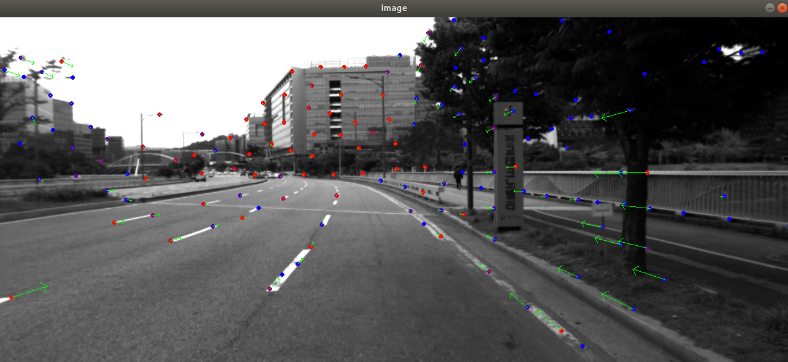
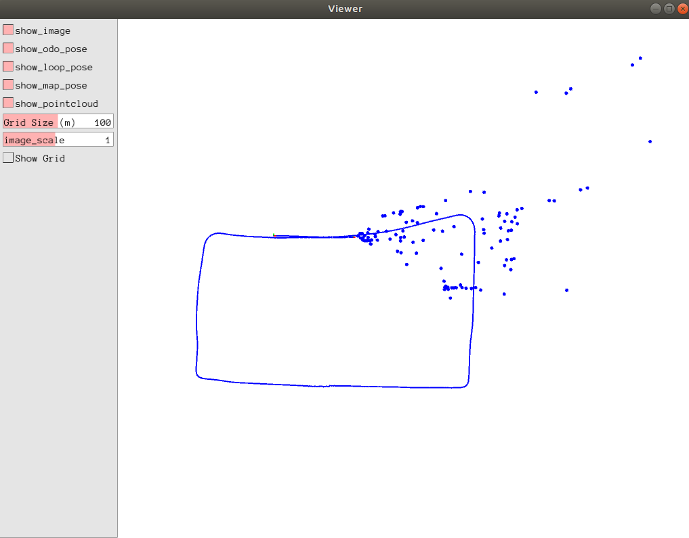

# introduction  
this is about visual mapping and localization by using single camera, imu and wheel speed sensor, by using ceres method.   

./bin/run_viwslam    
   
       

# dataset
https://pan.baidu.com/s/1ky_TDLMvdqJjwHuuuWquFA?pwd=1234     
tar -czvf urban39-pankyo.tar.gz urban39-pankyo/     
tar -xvf urban39-pankyo.tar.gz     

